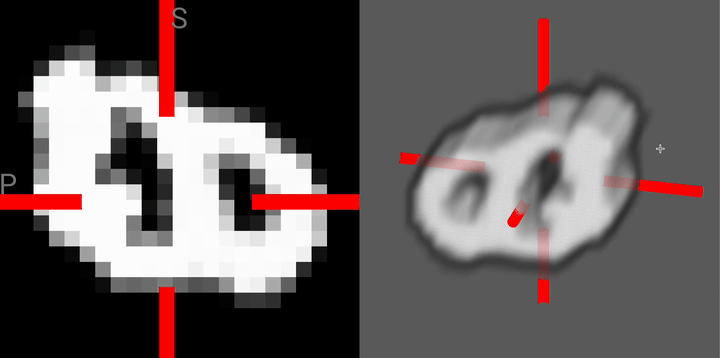

# 3D MNIST diffusion

Minimal implementation of Denoising Diffusion Probabilistic Models for 3D MNIST data



---

## Usage

Installation
```
git clone git@github.com:spikedoanz/3d-mnist-diffusion.git
cd 3d-mnist-diffusion
pip install torch torchvision numpy nibabel tqdm
```

To export some samples of the forward diffusion step. You can then toss the nii.gz files into [brainchop.org](https://github.com/neuroneural/brainchop) to get an interactive visualization.
```
python extras/noising_example.py
```

To train a model from scratch
```
python train.py
```

To continue training a model from the best checkpoint
```
python train.py --continue
```

---

## Generation Examples

---


## Details

- The model used here is not the standard UNet, but instead a [MeshNet](https://arxiv.org/abs/1811.11424) because I think they're more parameter efficient. You can hotswap it out with a UNet if you want.
- The model used for the generation examples was trained for 4000 epochs at batch size 64 on 4 L40s (about 12 hours)
- train.py is setup by default to either use distributed data parallel if cuda is available, or MPS if available.


---


## References 

DDPM paper: https://arxiv.org/abs/2006.11239

2d MNIST diffuion: https://github.com/bot66/MNISTDiffusion

lucidrains DDPM: https://github.com/lucidrains/denoising-diffusion-pytorch 
